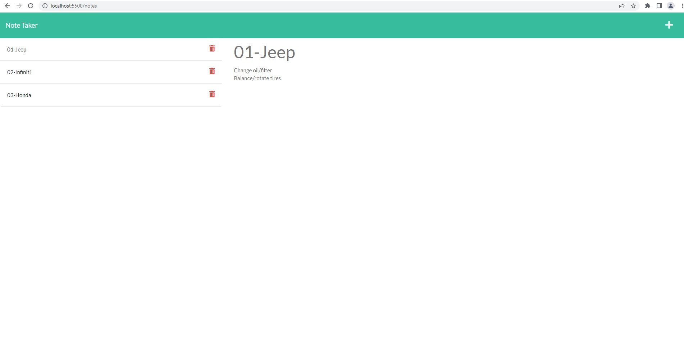

# Challenge Week #11 - Note Taker

## User Story
AS A small business owner  
I WANT to be able to write and save notes  
SO THAT I can organize my thoughts and keep track of tasks I need to complete  

## Acceptance Criteria
GIVEN a note-taking application  
WHEN I open the Note Taker  
THEN I am presented with a landing page with a link to a notes page  
WHEN I click on the link to the notes page  
THEN I am presented with a page with existing notes listed in the left-hand column, plus empty fields to enter a new note title and the note’s text in the right-hand column  
WHEN I enter a new note title and the note’s text  
THEN a Save icon appears in the navigation at the top of the page  
WHEN I click on the Save icon  
THEN the new note I have entered is saved and appears in the left-hand column with the other existing notes  
WHEN I click on an existing note in the list in the left-hand column  
THEN that note appears in the right-hand column  
WHEN I click on the Write icon in the navigation at the top of the page  
THEN I am presented with empty fields to enter a new note title and the note’s text in the right-hand column  

---

## Screenshots

Main screen  

Notes screen

Deleted item

---

## Live Site

This project cannot be used wtih GitHub Pages as it depends on NodeJS to run. To use the project, please clone the github repo. Once cloned, please perform the following tasks in your project folder at the GitBash prompt:

* npm init -y
* npm install express
* npm install jest --save-dev

You should now be able to run npm start to test the project.

---

## Summary/Languages

The Note Taker App front-end code was provided to us as a starting point. We were responsible for connecting the back-end using node.js and express.js to connect to the front-end. Notes data is saved to a JSON file acting as a database.

  

    

 

---

## Acknowledgements

Front-end provided by 2U Educational Services  
Back-end provided by Joseph Barbone/Andres Long (content tutor)